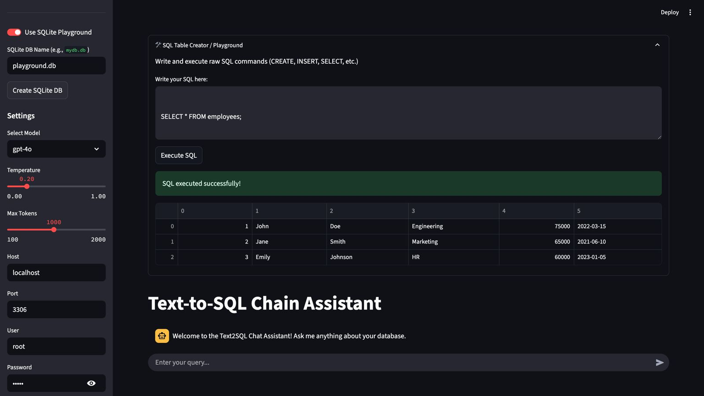

# 🚀 SQLPilot

**SQLPilot** is an AI-powered interface that lets you interact with databases using natural language. It supports both querying backend databases like MySQL and playing with custom tables using an intuitive SQLite Playground.

---

---
## ✨ Features

### 🧠 Text-to-SQL Assistant
- Ask questions in plain English (e.g., *"Show me the top 5 employees with highest salary"*) and get:
  - Auto-generated SQL query
  - Executed result table
  - Natural language explanation of the result (optional)
- Works with real backend databases (MySQL) using credentials provided in the backend.

### 🧪 SQLite Playground
- Create your own tables on the fly
- Insert, update, delete and fetch data using SQL
- Visual output in tabular format
- **Download** query results as JSON

---

## 📦 Technologies Used

- **Streamlit** – Web UI
- **LangChain + OpenAI GPT-4o** – Natural language → SQL
- **MySQL / SQLite** – Backend & local DB engines
- **Pandas** – Tabular data handling
- **Python** – Core logic

---

## 🔁 Workflow Diagram

```mermaid
graph TD;
    A[User Input in Natural Language] --> B{Is it Playground Mode?};
    B -- Yes --> C1[SQLite Session];
    B -- No --> C2[MySQL via LangChain];

    C1 --> D1[Parse or Build Tables];
    D1 --> E1[Run SQL Locally];
    E1 --> F1[Display Output Table];
    F1 --> G1[Allow JSON Download];

    C2 --> D2[Fetch DB Schema];
    D2 --> E2[LangChain + GPT → SQL Query];
    E2 --> F2[Execute Query on MySQL];
    F2 --> G2[Display SQL + Results + Explanation];

```

---

## 📄 License

This project is licensed under the MIT License. See the LICENSE file for details.

### MIT License
Copyright (c) 2024 [Your Name or Organization]

Permission is hereby granted, free of charge, to any person obtaining a copy
of this software and associated documentation files (the "Software"), to deal
in the Software without restriction, including without limitation the rights
to use, copy, modify, merge, publish, distribute, sublicense, and/or sell
copies of the Software, and to permit persons to whom the Software is
furnished to do so, subject to the following conditions:

The above copyright notice and this permission notice shall be included in all
copies or substantial portions of the Software.

THE SOFTWARE IS PROVIDED "AS IS", WITHOUT WARRANTY OF ANY KIND, EXPRESS OR
IMPLIED, INCLUDING BUT NOT LIMITED TO THE WARRANTIES OF MERCHANTABILITY,
FITNESS FOR A PARTICULAR PURPOSE AND NONINFRINGEMENT. IN NO EVENT SHALL THE
AUTHORS OR COPYRIGHT HOLDERS BE LIABLE FOR ANY CLAIM, DAMAGES OR OTHER
LIABILITY, WHETHER IN AN ACTION OF CONTRACT, TORT OR OTHERWISE, ARISING FROM,
OUT OF OR IN CONNECTION WITH THE SOFTWARE OR THE USE OR OTHER DEALINGS IN THE
SOFTWARE.

---

## 👨‍💻 Creator

**Made with ❤️ by [Madhav S Baidya]**  
**IIT (BHU) Varanasi**

If you found this project useful or inspiring, feel free to connect, contribute, or reach out for collaboration.

